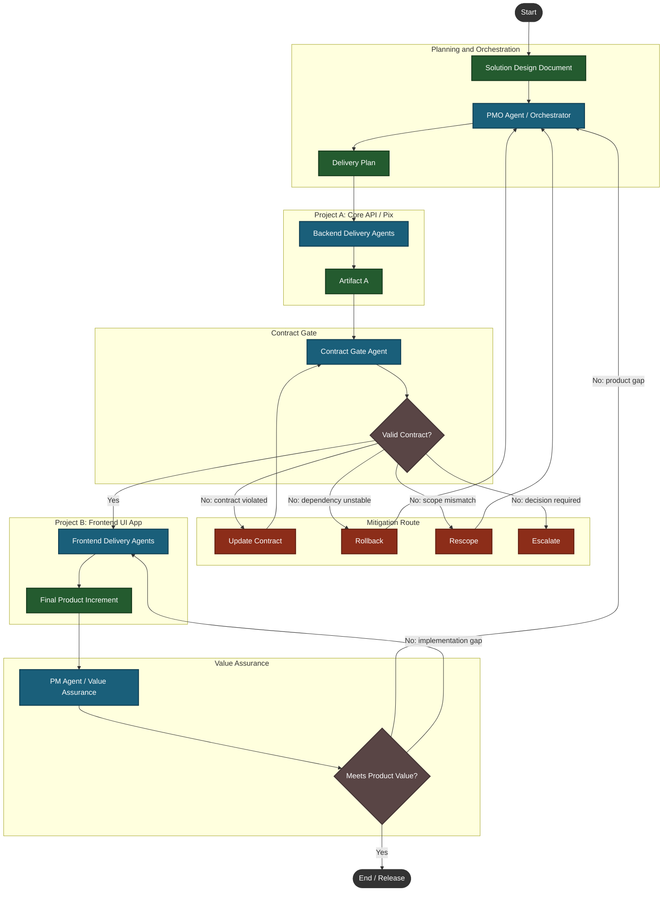

# Agile Agent Program — Program Layer

A LangGraph orchestration shell that sits above autonomous dark factory projects and coordinates end-to-end software delivery. It accepts a human-written Solution Design Document (SDD), breaks it into a structured Delivery Plan, triggers dark factory projects in sequence, validates contracts between them, and assures the final output meets the original intent before release.

> Jira project: [PB](https://thomaskury.atlassian.net/browse/PB-1) · Founding ticket: PB-1

## Architecture



### Agents

| Agent | Role |
|---|---|
| **SDD Parser Agent** | Converts raw SDD Markdown into a structured `SDD` Pydantic model |
| **PMO Agent** | Translates the parsed SDD into a `DeliveryPlan`; re-plans on mitigation re-entry |
| **Contract Gate Agent** | Evaluates Project A's output against Acceptance Criteria; selects a Mitigation Route on failure |
| **PM Agent** | Evaluates the final output against the original SDD intent; classifies gaps as product or implementation |

Dark factory projects (A and B) are LangGraph subgraphs. Stubs are included under `src/program_layer/stubs/` for development and testing.

## Installation

Requires Python 3.12+ and [`uv`](https://docs.astral.sh/uv/).

```bash
uv sync
```

## Configuration

Copy `.env.sample` to `.env` and fill in your keys:

```bash
cp .env.sample .env
```

| Variable | Default | Description |
|---|---|---|
| `ANTHROPIC_API_KEY` | — | Required for all primary agent calls |
| `OPENAI_API_KEY` | — | Required for fallback model calls |
| `PARSER_AGENT_MODEL` | `claude-sonnet-4-6` | Model for SDD Parser Agent |
| `PMO_AGENT_MODEL` | `claude-sonnet-4-6` | Model for PMO Agent |
| `CONTRACT_GATE_MODEL` | `claude-sonnet-4-6` | Model for Contract Gate Agent |
| `PM_AGENT_MODEL` | `claude-sonnet-4-6` | Model for PM Agent |
| `FALLBACK_MODEL` | `gpt-4o` | Global OpenAI fallback (all agents) |
| `CHECKPOINT_DB_PATH` | `./checkpoints.db` | SQLite checkpointer path |
| `MAX_RETRIES` | `3` | Loop guard threshold before forced Escalation |
| `LANGSMITH_TRACING` | `false` | Enable LangSmith tracing |
| `LANGSMITH_API_KEY` | — | LangSmith API key |
| `LANGSMITH_PROJECT` | `agile-agent-program` | LangSmith project name |
| `AUTO_APPROVE_ESCALATION` | `true` | Bypass interrupt in dev (set `false` in production) |
| `FACTORY_A_MODE` | `happy` | Stub scenario: `happy`, `failed`, or `partial` |
| `FACTORY_B_MODE` | `happy` | Stub scenario: `happy`, `failed`, or `partial` |

## Usage

```bash
uv run python -m program_layer.main --sdd path/to/your-sdd.md
```

Or via the installed script:

```bash
uv run program-layer --sdd path/to/your-sdd.md
```

The CLI streams execution events to stdout and prints the final status (`RELEASE` or interrupted with escalation details).

## Testing

```bash
uv run pytest
```

Tests run the full graph end-to-end with deterministic stubs — no mocking. Stub modes (`FACTORY_A_MODE`, `FACTORY_B_MODE`) cover happy-path, contract failure, and retry-limit escalation scenarios.

## Project Structure

```
src/program_layer/
├── agents/
│   ├── parser.py          # SDD Parser Agent
│   ├── pmo.py             # PMO Agent
│   ├── contract_gate.py   # Contract Gate Agent
│   └── pm.py              # PM Agent (Value Assurance)
├── nodes/
│   └── interrupt.py       # Escalation interrupt handler
├── schemas/
│   └── models.py          # All Pydantic models and ProgramState
├── stubs/
│   ├── factory_a.py       # Dark Factory A stub
│   └── factory_b.py       # Dark Factory B stub
├── config.py              # Env-var configuration
├── graph.py               # LangGraph assembly and routing
└── main.py                # CLI entrypoint
tests/                     # Full graph + per-agent tests
docs/
├── PRD.md                 # Product requirements for this layer
└── agents/                # Agent skill configuration docs
UBIQUITOUS_LANGUAGE.md     # Canonical domain glossary
layout.md                  # Architecture diagram source
```

## Key Documents

- [docs/PRD.md](docs/PRD.md) — full product requirements, user stories, and implementation decisions
- [UBIQUITOUS_LANGUAGE.md](UBIQUITOUS_LANGUAGE.md) — canonical domain glossary; use these terms in code, issues, and discussions
- [layout.md](layout.md) — architecture diagram source (Mermaid)
- [AGENTS.md](AGENTS.md) — conventions for AI agents working in this repo
